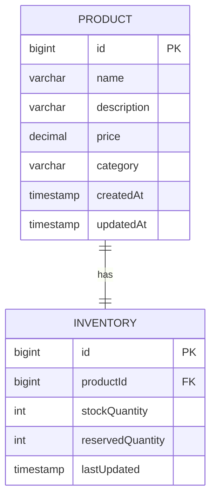
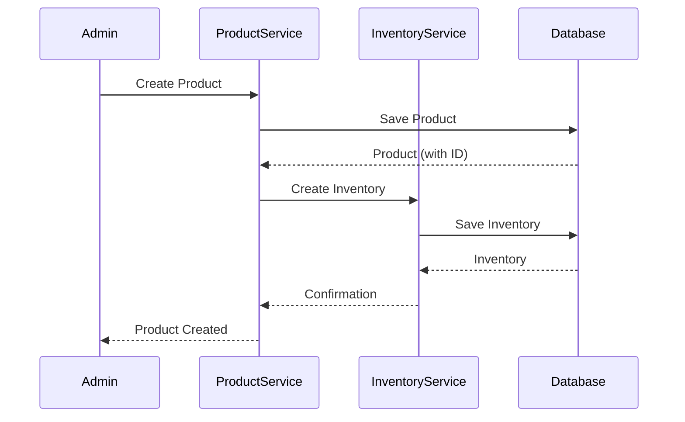
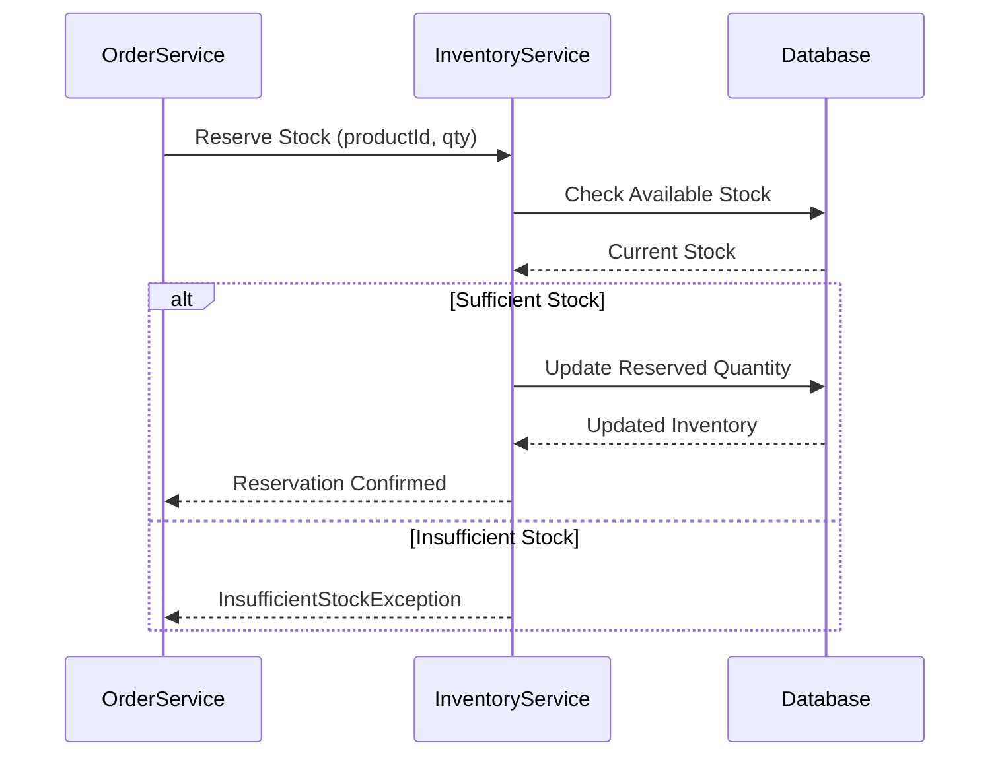
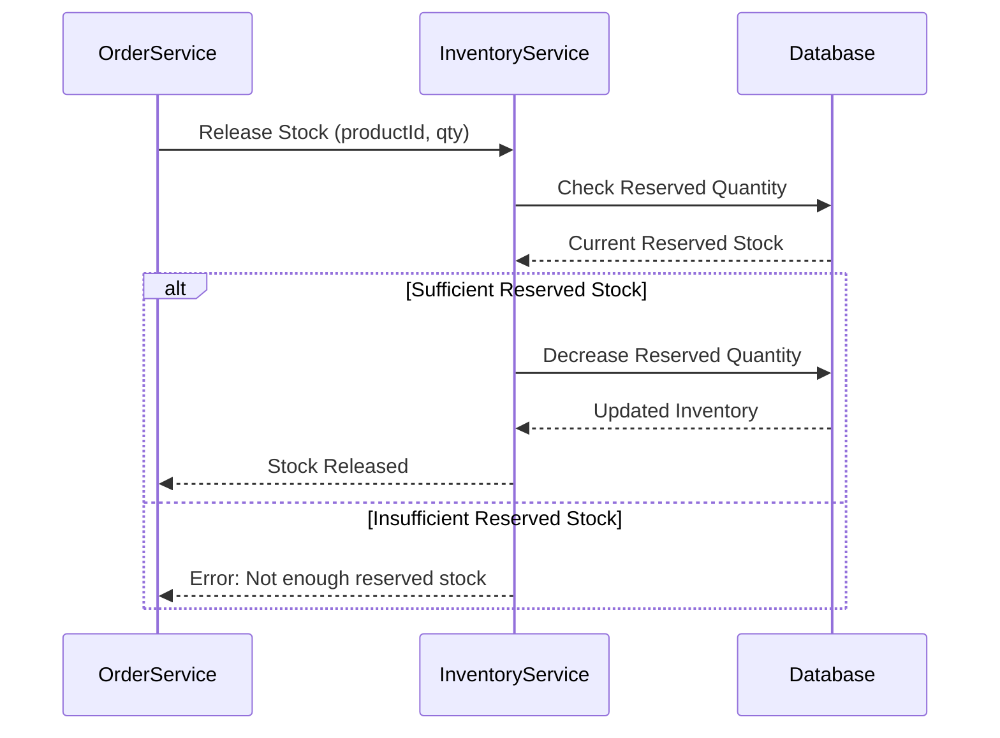
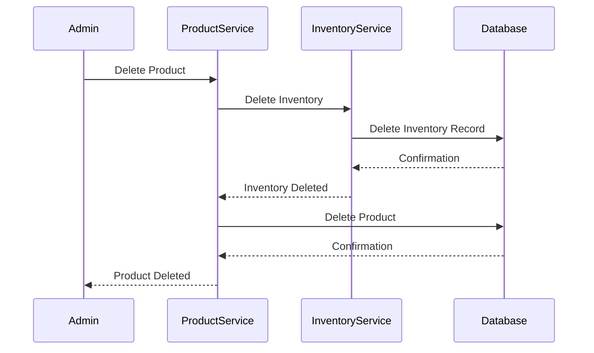

# Use Case: Product Catalog Management System

## 1. Business Context

An e-commerce company needs a system to manage its product catalog and inventory. The system must support the complete product lifecycle from creation to deletion, while maintaining accurate inventory information.

### Business Goals
- Efficient product catalog management
- Real-time inventory tracking
- Scalable architecture for future growth
- Cloud-ready deployment

## 2. Problem Domain

### Core Business Capabilities

1. **Product Catalog Management**
   - Create and maintain product information (name, description, price, category)
   - Search and filter products
   - Update product details
   - Remove obsolete products

2. **Inventory Management**
   - Track stock quantities
   - Monitor low stock levels
   - Reserve stock for orders
   - Release reserved stock on cancellation

### Business Rules

- Products must have a valid price (minimum 0.01)
- Stock quantities cannot be negative
- Products can be categorized for better organization
- Inventory must be created when a product is added
- Inventory must be removed when a product is deleted

## 3. Domain Model

### Entities

#### Product (Catalog Domain)
Represents product information in the catalog:
- **id**: Unique identifier
- **name**: Product name (required, max 100 chars)
- **description**: Product description (max 500 chars)
- **price**: Product price (required, min 0.01)
- **category**: Product category (required, max 50 chars)
- **createdAt**: Creation timestamp
- **updatedAt**: Last update timestamp

**Note**: Stock quantity is NOT part of Product - it's managed separately in Inventory domain.

#### Inventory (Inventory Domain)
Represents stock information:
- **id**: Unique identifier
- **productId**: Reference to product
- **stockQuantity**: Available stock
- **reservedQuantity**: Stock reserved for orders
- **availableQuantity**: Calculated (stockQuantity - reservedQuantity)
- **lastUpdated**: Last update timestamp

### Domain Relationships

```
Product (Catalog) ──┐
                    │
                    ├──> 1:1 relationship
                    │
Inventory ──────────┘
```

In the current monolith, this is a logical relationship. In microservices, it becomes a reference (productId).

### ER Diagram



## 4. Functional Requirements

### Product Catalog Domain

**FR-1**: Create Product
- **Actor**: System Administrator
- **Precondition**: None
- **Postcondition**: Product created with inventory record
- **Input**: name, description, price, category
- **Output**: Product with generated ID

**FR-2**: Retrieve Products
- **Actor**: Any user
- **Precondition**: Products exist
- **Postcondition**: None
- **Input**: Optional filters (category, price range, pagination)
- **Output**: List of products

**FR-3**: Update Product
- **Actor**: System Administrator
- **Precondition**: Product exists
- **Postcondition**: Product information updated
- **Input**: Product ID and updated information
- **Output**: Updated product

**FR-4**: Delete Product
- **Actor**: System Administrator
- **Precondition**: Product exists
- **Postcondition**: Product and associated inventory removed
- **Input**: Product ID
- **Output**: Confirmation

### Inventory Domain

**FR-5**: Create Inventory
- **Actor**: System (automatic on product creation)
- **Precondition**: Product exists
- **Postcondition**: Inventory record created
- **Input**: Product ID and initial stock quantity
- **Output**: Inventory record

**FR-6**: Update Stock
- **Actor**: Warehouse Manager
- **Precondition**: Inventory exists
- **Postcondition**: Stock quantity updated
- **Input**: Product ID and new stock quantity
- **Output**: Updated inventory

**FR-7**: Reserve Stock
- **Actor**: Order Service (future)
- **Precondition**: Sufficient stock available
- **Postcondition**: Stock reserved
- **Input**: Product ID and quantity to reserve
- **Output**: Updated inventory

**FR-8**: Release Stock
- **Actor**: Order Service (future)
- **Precondition**: Stock is reserved (reservedQuantity > 0)
- **Postcondition**: Reserved stock released back to available inventory
- **Input**: Product ID and quantity to release
- **Output**: Updated inventory (reservedQuantity decreased, availableQuantity increased)
- **Business Rules**:
  - Cannot release more stock than currently reserved
  - Released stock becomes available again for new reservations
  - Used when order is cancelled or times out

**FR-9**: Low Stock Alert
- **Actor**: Warehouse Manager
- **Precondition**: None
- **Postcondition**: None
- **Input**: Threshold value
- **Output**: List of products with low stock

## 5. Non-Functional Requirements

### Performance
- API response time < 200ms for read operations
- Support for pagination to handle large datasets

### Scalability
- Horizontal scaling capability
- Stateless design
- Database separation ready

### Reliability
- Transaction support for data consistency
- Error handling and validation
- Health monitoring

### Security
- Input validation
- SQL injection prevention
- Future: Authentication and authorization

### Maintainability
- Modular architecture
- Clear domain boundaries
- Comprehensive testing

## 6. System Architecture Evolution

### Phase 1: Modular Monolith (Current)

```
┌─────────────────────────────────────────────┐
│         Product Catalog Monolith            │
│                                             │
│  ┌──────────────────┐  ┌────────────────┐ │
│  │  Catalog Domain   │  │ Inventory      │ │
│  │  - Product        │  │ Domain         │ │
│  │  - Controller     │  │ - Inventory    │ │
│  │  - Service        │  │ - Controller   │ │
│  │  - Repository     │  │ - Service      │ │
│  └──────────────────┘  └────────────────┘ │
│                                             │
│  ┌───────────────────────────────────────┐ │
│  │      Shared Database (H2/PostgreSQL)  │ │
│  └───────────────────────────────────────┘ │
└─────────────────────────────────────────────┘
```

**Characteristics**:
- Single application
- Shared database
- Clear domain boundaries in code
- Easy to develop and test

### Phase 2: Microservices (Future)

```
┌─────────────────────┐      ┌─────────────────────┐
│ Product Catalog     │      │ Inventory Service   │
│ Service             │      │                     │
│ Port: 8081          │      │ Port: 8082           │
│                     │      │                     │
│ - Products          │      │ - Stock Management   │
│ - Categories        │      │ - Reservations       │
│                     │      │                     │
│ Database:           │      │ Database:           │
│ product_catalog_db  │      │ inventory_db         │
└──────────┬──────────┘      └──────────┬──────────┘
           │                            │
           └────────────┬───────────────┘
                        │
            ┌───────────▼───────────┐
            │   API Gateway         │
            │   (Spring Cloud)      │
            └──────────────────────┘
```

**Characteristics**:
- Separate services
- Independent databases
- Service discovery
- Inter-service communication

## 7. Business Workflows

### Workflow 1: Product Creation with Inventory



**Business Rule**: Every product must have an inventory record.

### Workflow 2: Stock Reservation



**Business Rule**: Cannot reserve more than available stock.

### Workflow 3: Stock Release



**Business Rule**: Cannot release more stock than currently reserved.

**Use Cases**:
- Order cancellation: Release reserved stock back to available inventory
- Order timeout: Release stock if order is not completed within time limit
- Order completion: Stock is consumed (reserved → sold, not released)

### Workflow 4: Product Deletion



**Business Rule**: Product and inventory must be deleted together.

## 8. Domain Boundaries

### Catalog Domain Responsibilities
- Product information management
- Category organization
- Product search and filtering
- Price management
- Product lifecycle (create, update, delete)

### Inventory Domain Responsibilities
- Stock quantity tracking
- Stock reservations
- Low stock monitoring
- Availability checks
- Stock movements

### Shared Responsibilities
- Exception handling
- Configuration management
- API documentation
- Health monitoring

## 9. Future Extensions

### Potential New Domains
- **Order Domain**: Order management and processing
- **User Domain**: User and authentication management
- **Notification Domain**: Alerts and notifications
- **Analytics Domain**: Reporting and analytics

### Integration Points
- Order Service → Inventory Service (stock reservation)
- Order Service → Product Catalog Service (product information)
- Notification Service → Inventory Service (low stock alerts)
